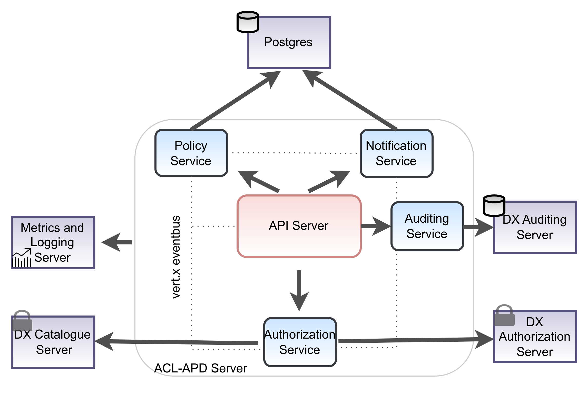
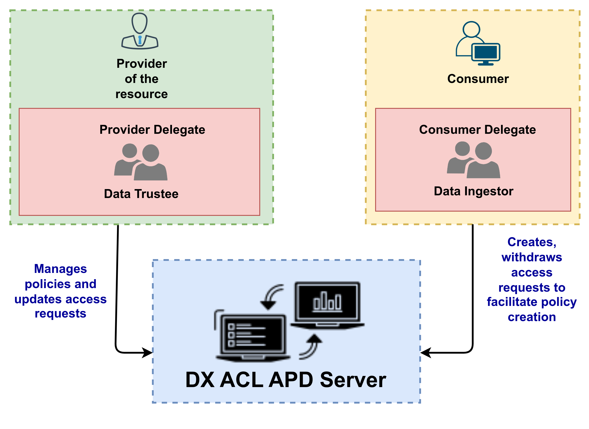

[%2F)](https://jenkins.iudx.io/job/ACL-APD%20Server(master)/lastBuild/)
[%2F)](https://jenkins.iudx.io/job/ACL-APD%20Server(master)/lastBuild/testReport/)
[%2F)](https://jenkins.iudx.io/job/ACL-APD%20Server(master)/lastBuild/jacoco/)
[%2F&label=integration%20tests)](https://jenkins.iudx.io/job/ACL-APD%20Server(master)/lastBuild/Integration_20Test_20Report/)
[%2F&label=security%20tests)](https://jenkins.iudx.io/job/ACL-APD%20Server(master)/lastBuild/zap/)

# DX-ACL-APD-Server
The Data Exchange (DX) Access Control List (ACL) based Access Policy Domain (APD)
is used for creating, requesting and managing policy. Provider, provider delegates could
allow the consumer, consumer delegates to access their resources by writing a policy against it.
Policies are verified by Data Exchange (DX) Authentication Authorization and Accounting Server (AAA) Server to
allow consumer, consumer delegates to access the resource.

## Features
- Allows provider, provider delegates to create, fetch, manage policies over their resources
- Allows consumers fetch policies, request access for resources by sending email notifications to the provider, provider delegates
- Emails are sent asynchronously using Vert.x SMTP Mail Client
- Integration with DX AAA Server for token introspection to serve data privately to the designated user
- Uses Vert.x, Postgres to create scalable, service mesh architecture
- Integration with auditing server for metering purposes

## Users and Roles

- Tokens for a user could be created using DX AAA Server API : [link to the API docs](https://authorization.iudx.org.in/apis#tag/Token-APIs/operation/post-auth-v1-token) 
- Provider, Consumers and delegates of provider and consumers are allowed to access the APIs
- Provider / provider delegate specific APIs : Create Policy, Update access request, Delete Policy
- Consumer / consumer delegate specific APIs : Create Access Request, Withdraw access request
- Commonly accessible APIs for both the users : List Access Request,  Get Policies
- How is the user considered as a consumer, provider or delegate?
   - If the **role** in token fetched from DX AAA Server is **provider**, **consumer**
   - A user is considered as a delegate of the consumer if **role** is **delegate** and **drl** is **consumer**
   - A user is considered as a delegate of the provider if **role** is **delegate** and **drl** is **provider**

## API Docs
API docs are available [here](https://acl-apd.iudx.org.in/apis)

## How To Guide
-> Provide the link here #TODO

## Tutorials and Explanations
-> Provide the link here #TODO

## FAQ
FAQs are available [here](./docs/FAQ.md)

## Get Started
SETUP and installation guide is available [here](./docs/SETUP-and-Installation.md)

## Contributing
We follow Git Merge based workflow
1. Fork this repo
2. Create a new feature branch in your fork. Multiple features must have a hyphen separated name
3. Commit to your fork and raise a Pull Request with upstream

## License
[View License](./LICENSE)

