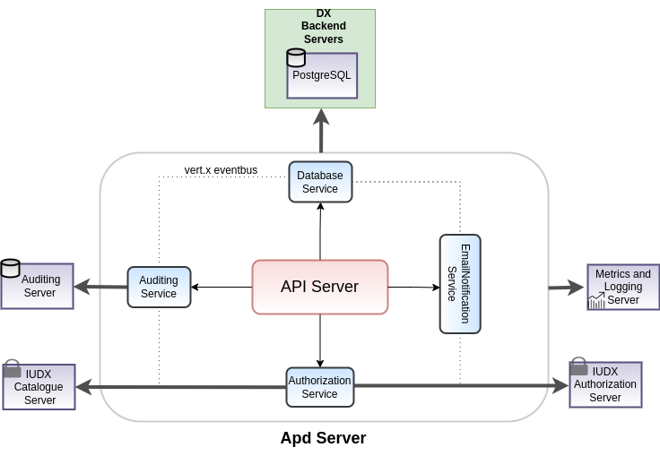

TODO: Include badges


# DX-ACL-APD-Server
Data Exchange (DX) Access Control Layer (ACL) and Access Policy Domain (APD)
is used for creating, requesting and managing policy. Provider, provider delegates could
allow the consumer, consumer delegates to access their resources by writing a policy against it.
Policies are verified by Data Exchange (DX) Authentication Authorization and Accounting Server (AAA) Server to
allow consumer, consumer delegates to access the resource.

<p align="center">

</p>


## Features
- Allows provider, provider delegates to create, fetch, manage policies over their resources
- Allows consumers fetch policies, request access for resources by sending email notifications to the provider, provider delegates 
- Emails are sent asynchronously using Vert.x SMTP Mail Client
- Integration with DX AAA Server for token introspection to serve data privately to the designated user
- Uses Vert.x, Postgres to create scalable, service mesh architecture
- Integration with auditing server using RabbitMQ databroker for metering purposes


## API Docs
API docs are available here : [link](https://acl-apd.iudx.io/apis)

## Prerequisites
### External Dependencies Installation

The DX ACL-APD Server connects with various external dependencies namely:
- PostgreSQL
- RabbitMQ

Find the installation of the above along with the configurations to modify the database url, port, and associated credentials
in te appropriate sections [here](SETUP.md)

## Get Started

### Docker based
1. Install docker and docker-compose
2. Clone this repo
3. Build the images
   ` ./docker/build.sh`
4. Modify the `docker-compose.yml` file to map the config file you just created
5. Start the server in production (prod) or development (dev) mode using docker-compose
   ` docker-compose up prod `
### Maven based
1. Install java 13 and maven
2. Use the maven exec plugin based starter to start the server
   `mvn clean compile exec:java@acl-apd-server`

### JAR based
1. Install java 11 and maven
2. Set Environment variables
```
export ACL_APD_URL=https://<acl-apd-domain-name>
export LOG_LEVEL=INFO
```
3. Use maven to package the application as a JAR
   `mvn clean package -Dmaven.test.skip=true`
4. 2 JAR files would be generated in the `target/` directory
    - `iudx.iudx.apd.acl.server-cluster-0.0.1-SNAPSHOT-fat.jar` - clustered vert.x containing micrometer metrics
    - `iudx.iudx.apd.acl.server-dev-0.0.1-SNAPSHOT-fat.jar` - non-clustered vert.x and does not contain micrometer metrics


#### Running the clustered JAR
**Note**: The clustered JAR requires Zookeeper to be installed. Refer [here](https://zookeeper.apache.org/doc/r3.3.3/zookeeperStarted.html) to learn more about how to set up Zookeeper. Additionally, the `zookeepers` key in the config being used needs to be updated with the IP address/domain of the system running Zookeeper.
The JAR requires 3 runtime arguments when running:

* --config/-c : path to the config file
* --hostname/-i : the hostname for clustering
* --modules/-m : comma separated list of module names to deploy

e.g. ```java -jar target/iudx.iudx.apd.acl.server-cluster-0.0.1-SNAPSHOT-fat.jar --host $(hostname) 
-c configs/config.json -m iudx.apd.acl.server.authentication.AuthenticationVerticle, iudx.apd.acl.server.apiserver.ApiServerVerticle,
iudx.apd.acl.server.policy.PolicyVerticle, iudx.apd.acl.server.notification.NotificationVerticle```

Use the `--help/-h` argument for more information. You may additionally append an `ACL_APD_JAVA_OPTS` environment
variable containing any Java options to pass to the application.

e.g.
```
$ export ACL_APD_JAVA_OPTS="Xmx40496m"
$ java $ACL_APD_JAVA_OPTS -jar target/iudx.iudx.apd.acl.server-cluster-0.0.1-SNAPSHOT-fat.jar ...

```


#### Running the non-clustered JAR
The JAR requires 1 runtime argument when running

* --config/-c : path to the config file

e.g. `java -Dvertx.logger-delegate-factory-class-name=io.vertx.core.logging.Log4j2LogDelegateFactory -jar target/iudx.iudx.apd.acl.server-cluster-0.0.1-SNAPSHOT-fat.jar -c configs/config.json`

Use the `--help/-h` argument for more information. You may additionally append an `RS_JAVA_OPTS` environment variable containing any Java options to pass to the application.

e.g.
```
$ export ACL_APD_JAVA_OPTS="-Xmx1024m"
$ java ACL_APD_JAVA_OPTS -jar target/iudx.iudx.apd.acl.server-cluster-0.0.1-SNAPSHOT-fat.jar ...
```

### Testing
1. Run the server through either docker, maven or redeployer
2. Run the unit tests and generate a surefire report
   `mvn clean test-compile surefire:test surefire-report:report`
3. Reports are stored in `./target/

## Contributing
We follow Git Merge based workflow
1. Fork this repo
2. Create a new feature branch in your fork. Multiple features must have a hyphen separated name
3. Commit to your fork and raise a Pull Request with upstream


## License
[MIT](./LICENSE.txt)

